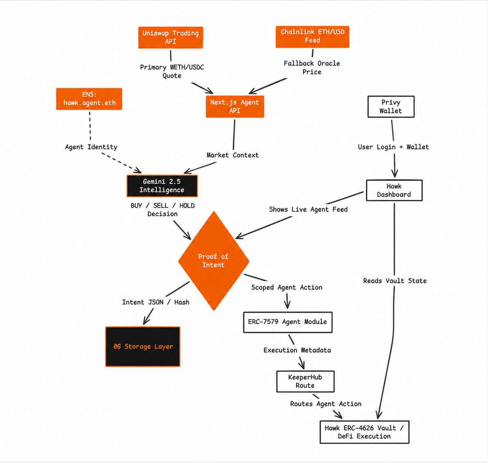

<p align="center">
  
</p>

<h1 align="center">Hawk by TRECC</h1>

<p align="center">
  <strong>Accountable autonomous yield management for DeFi vaults.</strong>
</p>

<p align="center">
  <a href="https://ethglobal.com/events/openagents">ETHGlobal Open Agents</a>
  ·
  <a href="https://trecc.finance">TRECC</a>
  ·
  <a href="https://sepolia.etherscan.io/address/0x387Be077b26E473d42BE0fF919aeb63Cd241545c">Sepolia Contract</a>
</p>

---

## Overview

Hawk is an autonomous DeFi prime-brokerage prototype that lets users deposit USDC into an ERC-4626 vault while an AI agent manages a higher-risk alpha tranche. The key idea is simple: an agent should not be a black box when it moves user capital.

Before Hawk routes an action, it produces a structured intent containing the market data, decision, confidence, and reasoning behind the trade. The frontend shows those intents in real time, the backend uses live market data where available, and the vault contract separates protected user deposits from operator bond risk.

## The Problem

Autonomous trading agents can rebalance faster than humans, but most agent demos skip the hard part: accountability. If an agent loses funds, users and judges need to know:

- What market data did the agent see?
- Why did it choose buy, sell, hold, or rebalance?
- Which execution layer routed the transaction?
- Who posted risk capital for that agent?
- Can the decision be inspected after the fact?

Hawk answers this with a Proof-of-Intent flow and a tranche-based vault model.

## What We Built

- **ERC-4626 senior vault** for USDC deposits, deployed on Sepolia.
- **ERC-7579 agent containment layer** for modeling modular smart-account permissions around autonomous execution.
- **Operator bond system** where agents need posted ETH collateral before being approved.
- **AI strategy endpoint** that asks Gemini for structured WETH intent decisions.
- **Market data fallback stack** using Uniswap Trading API first, then Chainlink ETH/USD on Sepolia.
- **Proof-of-Intent execution feed** that surfaces the agent's decision, confidence, and reasoning before routing.
- **Privy wallet onboarding** for email/wallet login and embedded wallet support.
- **Professional dashboard UI** for liquidity, tranche selection, live WETH/USDC pricing, user position, and agent logs.

## Demo Flow

1. Connect with Privy.
2. Read the deployed Sepolia Hawk vault and user share balance.
3. Pull a WETH/USDC quote from Uniswap Trading API.
4. If the Uniswap quote is unavailable, read Chainlink's Sepolia ETH/USD feed.
5. Send market state into Gemini 2.5 Flash.
6. Render the agent's structured BUY, SELL, or HOLD intent.
7. Contain the agent action through the ERC-7579 smart-account module layer.
8. Mark the decision as 0G-secured in the execution feed.
9. Route the action through the KeeperHub execution path in the prototype.

> Current hackathon note: the repository includes the production-facing integration points and UI flow. 0G storage and KeeperHub execution are represented through the agent modules and execution feed for demo reliability, while the ERC-4626 vault is deployed on Sepolia.

## Deployed Contract

| Network | Contract | Address |
| --- | --- | --- |
| Sepolia | Hawk ERC-4626 Vault | [`0x387Be077b26E473d42BE0fF919aeb63Cd241545c`](https://sepolia.etherscan.io/address/0x387Be077b26E473d42BE0fF919aeb63Cd241545c) |
| Sepolia | USDC Asset | [`0x1c7D4B196Cb0C7B01d743Fbc6116a902379C7238`](https://developers.circle.com/stablecoins/docs/usdc-on-test-networks) |
| Sepolia | Chainlink ETH/USD Feed | [`0x694AA1769357215DE4FAC081bf1f309aDC325306`](https://docs.chain.link/data-feeds/price-feeds/addresses?network=ethereum&page=1) |

Deployment metadata lives in [`contracts/deployments/sepolia.json`](./contracts/deployments/sepolia.json).

## Protocols & Sponsor Integrations

| Logo | Protocol | How Hawk Uses It | Link |
| --- | --- | --- | --- |
|  | **0G** | Proof-of-Intent memory layer for storing agent decisions before execution. | [0g.ai](https://0g.ai/) |
|  | **Uniswap** | Primary WETH/USDC quote source through the Uniswap Trading API; core strategy code also includes Uniswap V3 pool state reads. | [API docs](https://api-docs.uniswap.org/) |
|  | **KeeperHub** | Execution and routing layer for agent actions after intent creation. | [keeperhub.com](https://keeperhub.com/) |
|  | **Chainlink Price Feeds** | Reliable fallback oracle for ETH/USD pricing on Sepolia when Uniswap API data is unavailable. | [Price Feeds](https://docs.chain.link/data-feeds/price-feeds) |
|  | **Privy** | Wallet login, embedded wallet support, and user onboarding. | [privy.io](https://www.privy.io/) |
|  | **ERC-7579** | Modular smart-account standard used as Hawk's agent containment model for scoped execution permissions. | [EIP-7579](https://eips.ethereum.org/EIPS/eip-7579) |
|  | **Gemini API** | AI reasoning layer that emits structured trading intents with confidence and routing metadata. | [Gemini docs](https://ai.google.dev/gemini-api/docs/models/gemini) |
|  | **Ethereum Sepolia** | Testnet deployment environment for the Hawk vault and oracle reads. | [ethereum.org](https://ethereum.org/developers/docs/networks/) |
|  | **ENS** | Human-readable agent identity shown as `hawk.agent.eth` in the dashboard. | [ens.domains](https://ens.domains/) |
|  | **Circle USDC** | Sepolia USDC is the underlying asset for the ERC-4626 senior vault. | [Circle testnet USDC](https://developers.circle.com/stablecoins/docs/usdc-on-test-networks) |
|  | **OpenZeppelin** | ERC-4626, ERC-20, and Ownable contract foundations. | [ERC-4626 docs](https://docs.openzeppelin.com/contracts/5.x/erc4626) |

## Architecture




## Smart Contract Design

[`contracts/contracts/Hawk.sol`](./contracts/contracts/Hawk.sol) implements:

- `ERC4626`: tokenized USDC vault shares.
- `postBond()`: lets operators post ETH as first-loss collateral.
- `registerAgent(address agent)`: approves an agent once the operator has enough bond.
- `slashBond(address operator, uint256 amount)`: owner-controlled slashing for bad execution in the prototype.

The deployed vault demonstrates the capital structure, while ERC-7579 describes the modular smart-account layer Hawk uses for agent containment: the agent can reason freely, but execution is scoped through a permissioned module path before KeeperHub routing.

This is intentionally minimal for the hackathon: the contract demonstrates the capital structure and agent containment primitive without burying the core idea under unnecessary contract surface area.

## Repository Structure

```text
.
├── contracts/
│   ├── contracts/Hawk.sol              # ERC-4626 vault + operator bond registry
│   ├── scripts/deploy.ts               # Sepolia deployment script
│   └── deployments/sepolia.json        # Deployed address and asset metadata
├── frontend/
│   ├── app/page.tsx                    # Hawk dashboard
│   ├── app/api/agent/route.ts          # Agent reasoning + market data endpoint
│   └── app/Providers.tsx               # Privy provider
├── src/
│   ├── modules/ZeroGMemory.ts          # Proof-of-Intent storage module
│   ├── modules/UniswapInterface.ts     # Uniswap V3 pool state reads
│   ├── modules/KeeperExecution.ts      # KeeperHub execution module
│   └── index.ts                        # Agent loop prototype
├── diagram.png
└── logo.png
```

## Quick Start

### 1. Install root dependencies

```bash
npm install
```

### 2. Configure contracts

```bash
cp .env.example .env
```

Required root variables:

```bash
RPC_URL=https://eth-sepolia.g.alchemy.com/v2/YOUR_KEY
PRIVATE_KEY=YOUR_DEPLOYER_PRIVATE_KEY
```

### 3. Run contract tests

```bash
cd contracts
npm install
npx hardhat test
```

### 4. Configure frontend

```bash
cd frontend
npm install
cp .env.eg .env
```

Recommended frontend variables:

```bash
NEXT_PUBLIC_PRIVY_APP_ID=YOUR_PRIVY_APP_ID
NEXT_PUBLIC_UNISWAP_API_KEY=YOUR_UNISWAP_API_KEY
GEMINI_API_KEY=YOUR_GEMINI_API_KEY
```

### 5. Run the app

```bash
npm run dev
```

Open `http://localhost:3000`.

## Judge Notes

- The strongest part of Hawk is the accountability pattern: decisions are surfaced as structured intents before execution.
- The vault is live on Sepolia and uses official Sepolia USDC.
- The backend has a resilient market-data path: Uniswap first, Chainlink fallback, safe demo fallback if external APIs are unavailable.
- The UI is designed for a live demo: it keeps showing agent decisions even when sponsor APIs rate limit during judging.
- The contract is intentionally compact so judges can audit it quickly.

## Built With

Next.js, React, TypeScript, Tailwind CSS, ethers.js, Hardhat, Solidity, OpenZeppelin Contracts, ERC-4626, ERC-7579, Privy, Gemini API, Uniswap APIs, Chainlink Price Feeds, 0G, KeeperHub, and Sepolia.

---

Built by the TRECC team for ETHGlobal Open Agents.
